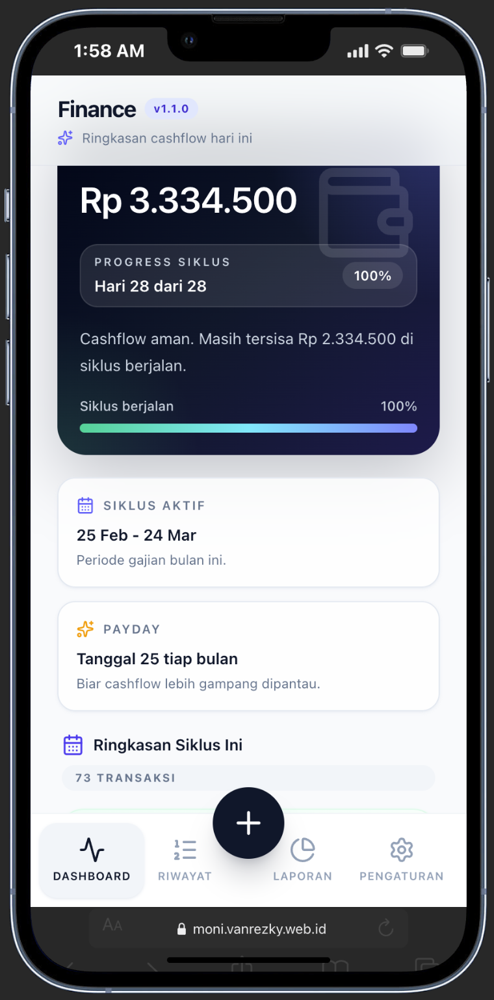

# 💰 Moni — Personal Finance Tracker

> Simple. Insightful. In Control.

Moni adalah aplikasi pencatatan keuangan personal/rumah tangga berbasis **React + Vite** yang membantu Anda memantau cashflow dengan lebih jelas, cepat, dan praktis.

---

## 📱 Preview

<p align="center">
  
</p>

---

## ✨ Features

- 💵 Track income & expenses effortlessly
- 📊 Real-time cashflow summary
- 📆 Smart cycle tracking (salary period)
- ⚡ Clean, fast, and responsive UI
- 📱 Installable as a PWA (mobile-ready)
- 🎯 Focused on simplicity & usability
- 🔐 Authentication dengan Firebase Auth
- ☁️ Sinkronisasi data dengan Cloud Firestore

---

## 🧠 Key Concept

Moni dibangun dengan fokus pada **cashflow cycle awareness**:

- Mengetahui batas aman pengeluaran
- Memantau progres dalam satu siklus gajian
- Membantu menghindari overspending sebelum payday

---

## 🛠 Tech Stack

- **Frontend**: React 19 + Vite
- **Styling**: Tailwind CSS
- **Backend services**: Firebase Authentication + Cloud Firestore
- **Deployment**: Vercel
- **PWA**: Service Worker + Web App Manifest

---

## ⚙️ Installation

```bash
npm install
```

---

## 🔐 Firebase Setup

Sebelum menjalankan aplikasi secara lokal, siapkan project Firebase terlebih dahulu.

### 1. Aktifkan provider Authentication

Buka **Firebase Console → Authentication → Sign-in method**, lalu aktifkan:

- **Google**
- **Email/Password**
- **Anonymous**

> Disarankan menyimpan konfigurasi Auth ini sejak awal agar environment lokal, staging, dan production konsisten.

### 2. Buat file environment

Salin file contoh env:

```bash
cp .env.example .env
```

Lalu isi seluruh variabel Firebase berikut:

- `VITE_FIREBASE_API_KEY` — API key dari Firebase web app.
- `VITE_FIREBASE_AUTH_DOMAIN` — auth domain project Firebase.
- `VITE_FIREBASE_PROJECT_ID` — project ID Firebase.
- `VITE_FIREBASE_STORAGE_BUCKET` — storage bucket project.
- `VITE_FIREBASE_MESSAGING_SENDER_ID` — sender ID untuk Firebase app.
- `VITE_FIREBASE_APP_ID` — app ID dari Firebase web app.
- `VITE_FIREBASE_FIRESTORE_DATABASE_ID` — ID database Firestore yang digunakan aplikasi.

Contoh `.env`:

```env
VITE_FIREBASE_API_KEY=your_api_key
VITE_FIREBASE_AUTH_DOMAIN=your-project.firebaseapp.com
VITE_FIREBASE_PROJECT_ID=your-project-id
VITE_FIREBASE_STORAGE_BUCKET=your-project.firebasestorage.app
VITE_FIREBASE_MESSAGING_SENDER_ID=1234567890
VITE_FIREBASE_APP_ID=1:1234567890:web:abcdef123456
VITE_FIREBASE_FIRESTORE_DATABASE_ID=(default)
GEMINI_API_KEY=
```

### 3. Catatan akun guest / anonymous

Jika user masuk sebagai **guest/anonymous**, tetap buat dokumen profil di koleksi:

- `users/{uid}`

Dengan begitu, alur aplikasi tetap konsisten untuk lookup profil, household aktif, dan sinkronisasi data pengguna.

### 4. Ringkasan struktur Firestore

Struktur data utama yang digunakan aplikasi:

- `users/{uid}`
- `households/{householdId}`
- `households/{householdId}/transactions/{transactionId}`

Penjelasan singkat:

- `users/{uid}` menyimpan profil user dan household aktif (`currentHouseholdId`).
- `households/{householdId}` menyimpan metadata rumah tangga seperti anggota, owner, dan payday.
- `households/{householdId}/transactions/{transactionId}` menyimpan transaksi pemasukan/pengeluaran.

---

## ▶️ Run Locally

```bash
npm run dev
```

Aplikasi akan membaca konfigurasi Firebase dari file `.env`.

---

## 📦 Build

```bash
npm run build
```

---

## 🌐 Live Demo

👉 https://moni.vanrezky.web.id

---

## 📱 PWA Support

Moni dapat diinstal seperti aplikasi native:

- Add to Home Screen
- Dukungan offline
- Fast loading experience

---

## 🚀 Deployment

Dideploy menggunakan Vercel dengan alur CI/CD otomatis:

- Push ke `main` → Production
- Preview deployments (opsional)

Pastikan seluruh environment variable Firebase juga dikonfigurasi di dashboard deployment.

---

## 👤 Author

**Van Rezky**

---

## 📄 License

MIT License
